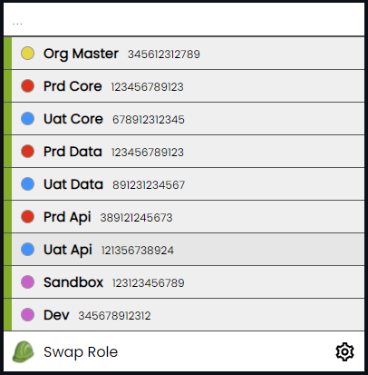
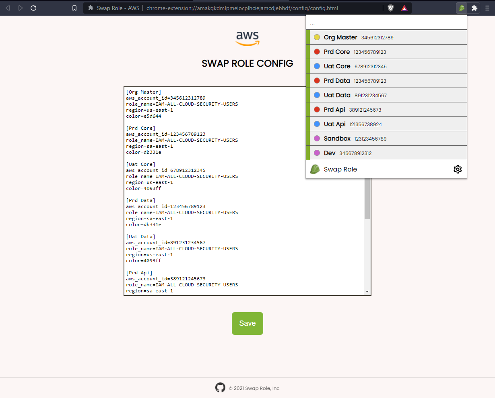

<h1 align="center">SWAP ROLE</h1>

<div align="center">
    <a href="#about">About</a>&nbsp;&nbsp;&nbsp;|&nbsp;&nbsp;&nbsp;
    <a href="#how-to-use">How to use</a>&nbsp;&nbsp;&nbsp;|&nbsp;&nbsp;&nbsp;
    <a href="#installation">Installation</a>&nbsp;&nbsp;&nbsp;|&nbsp;&nbsp;&nbsp;
    <a href="#contributing">Contributing</a>&nbsp;&nbsp;&nbsp;|&nbsp;&nbsp;&nbsp;
    <a href="#contributors">Contributors</a>&nbsp;&nbsp;&nbsp;|&nbsp;&nbsp;&nbsp;
    <a href="#license">License</a>
</div>

<br>

## About
Swap role is an extension to facilitate swapping AWS roles.


 
## How to use
Save the role swapping information on the extensions configuration page.

Example:
```
[Prd]
aws_account_id=123456789012
role_name=ROLE-NAME
region=us-east-1
color=86868f
```

In AWS website, click on the extension and a popup will appear with a list of your roles.



## Installation

1. Clone git repository
2. Enter the extensions tab
3. Enable developer mode
4. Load unpacked extension

## Contributing
1. Fork the project
2. Create your branch (`git checkout -b branch-name`)
3. Add your changes (`git add .`)
4. Commit your changes (`git commit -m 'add some feature'`)
5. Push to the branch (`git push origin branch-name`)
6. Open a pull request

## Contributors
<table>
  <tr>
    <td align="center">
      <a href="#">
        <br>
        <sub>
          <b>Matheus Almeida</b>
        </sub>
      </a>
    </td>
    <td align="center">
      <a href="#">
        <br>
        <sub>
          <b>Davidson Marra</b>
        </sub>
      </a>
    </td>
  </tr>
</table>

## License
Distributed under the MIT License. See [LICENSE](LICENSE) for more information.
